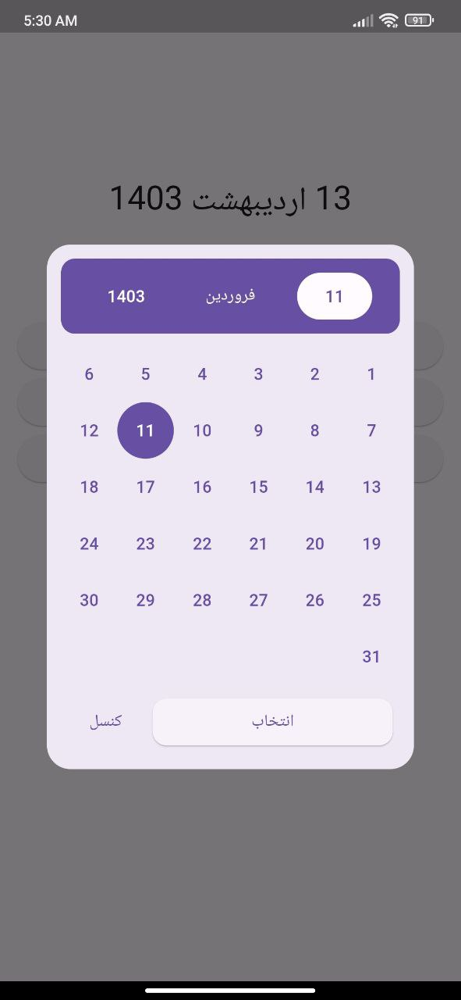

# persian_calendar_widget

A Flutter package that provides users access to pick a date using a Persian calendar.

## Screen Shots
| Minimal calendar | |
|:-:|:-:|
|  |  |


## Usage

### MinimalPersianCalendar.pickFullDate widget

```Dart
/// pickFullDate dialog box
ElevatedButton(
    onPressed: () {
        /// open date picker widget
        /// user have access to pick day, month and year
        MinimalPersianCalendar.pickFullDate(
            context: context,
            onSubmit: (jalaliDate, dateInText) {
                /// when user choose date from dialog box and submit two
                /// types of `Jalali` date returned here
                /// Jalali [jalaliDate]: Jalali(year, month, day, hour, minute, second, millisecond)
                /// String [dateInText]: '۱۴۰۳ اردیبهشت ۱۲'
                setState(() {
                    selectedDate = dateInText;
                });
                log('dateInText of pick full date: $dateInText');
                log('jalaliDate of pick full date: $jalaliDate');
            },
        );
    },
    child: const Text('انتخاب روز ماه و سال')),
```


## Documentation

### MinimalPersianCalendar Parameters

| Parameter    | Description                                       | Type                                                   | Default              |
|--------------|---------------------------------------------------|--------------------------------------------------------|----------------------|
| `onSubmit`   | Callback function returning the picked date      | Function(Jalali jalaliDate, String dateInText)          | Required             |
| `initialDate`| Initial date displayed in the calendar            | DateTime                                               | DateTime.now()               |
| `borderRadius` | Border radius of the dialog box                 | double                                                 | 20                 |
| `maxYear`    | Maximum selectable year                           | int                                                    | DateTime.now() + 11|
| `minYear`    | Minimum selectable year                           | int                                                    | DateTime.now()     |
